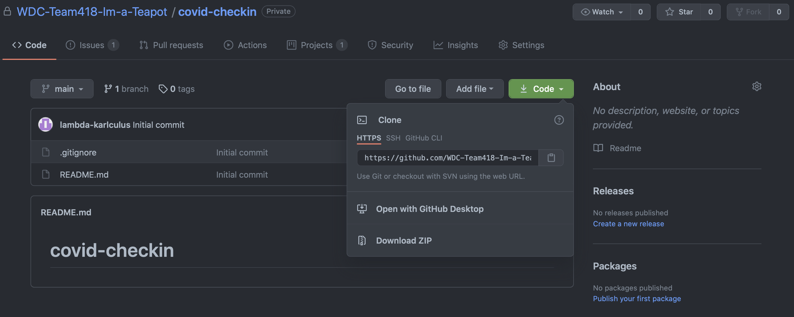
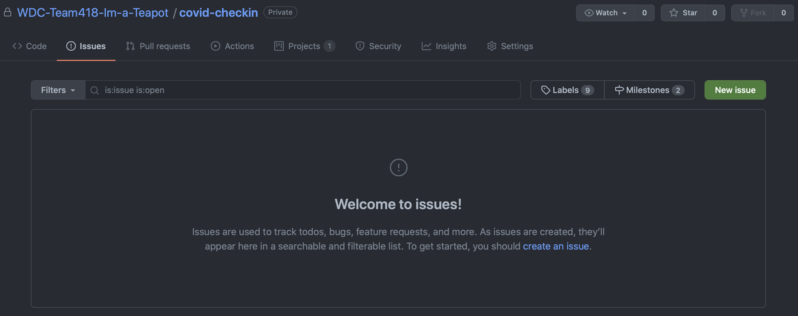
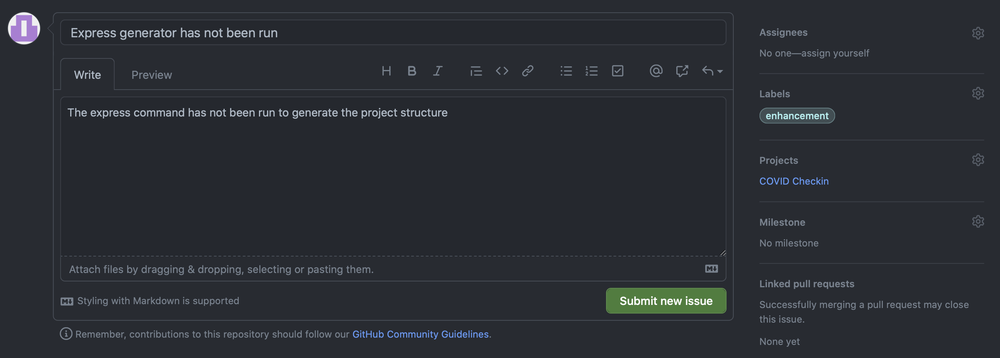
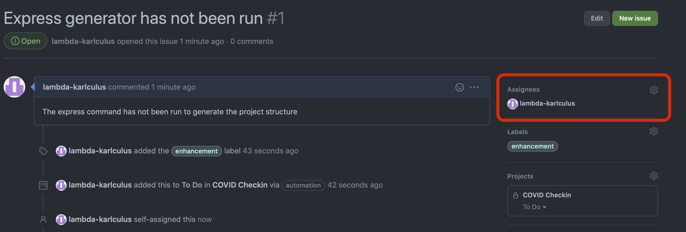
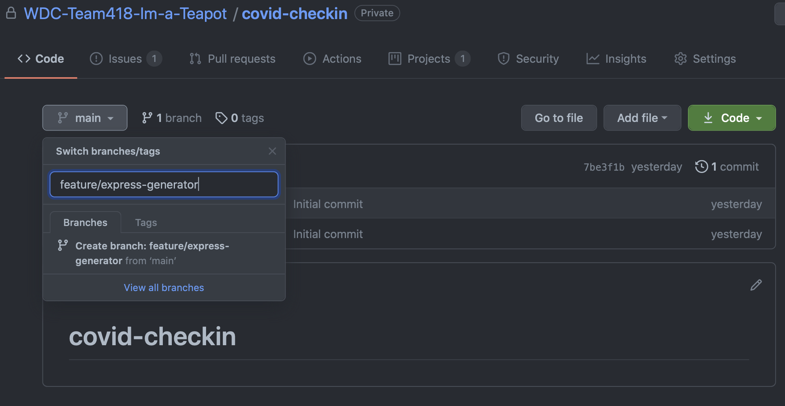
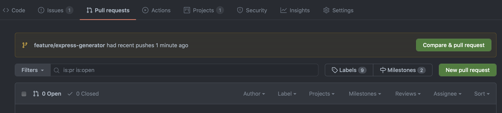
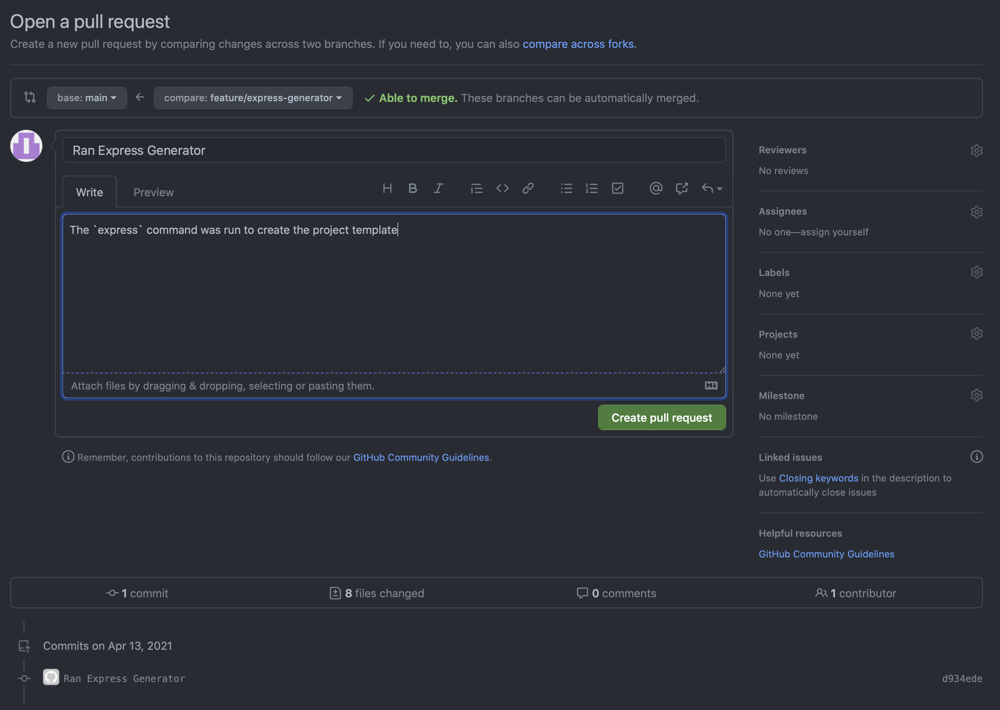
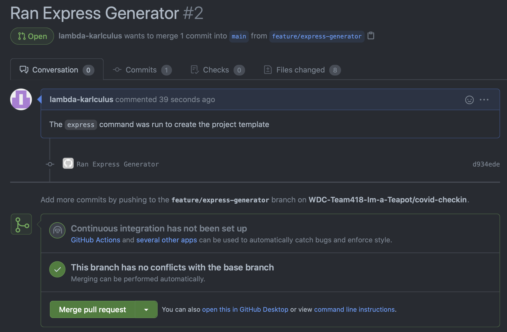
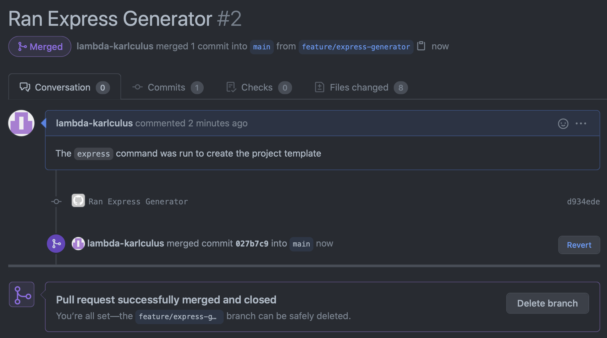

= Git & GitHub Primer
Karl Asenstorfer
v1.0
:toc: auto

If you are not up to speed with Git and GitHub, this document will introduce
some of the basics and guide you through the common GitHub workflow

== Git Basics

Git is a _distributed_ version control system. So unlike SVN (subversion), there
is no central repository containing all the code. Instead everyone who works on
the repository has a complete copy of every change. When you commit changes
those changes are committed to your local copy. In order for everyone to keep in
sync we can assign a common repository where everyone will *_push_* their changes 
to. We will be using GitHub for this purpose.

You may be thinking, "what happens when 2 or developers modify the same file?"
Git is *_merge_* focussed, meaning that it is especially good at merging the
changes that different developers have made to the same files, and can guide you
to manually merge them if it can't work it out.

== Getting Started with your respository

=== Clone the repository

After you have set up your GitHub account, you can *_clone_* the repository to
get your local copy.

. Click the clone button and copy the https link to the repository (GitHub even
  provides a handy button to do it)
  

[start="2"]  
. In the CS50 IDE terminal `cd` to the directoryt where you want to place the
  repository, it can be anywhere (even you have directory)
  
. use `git` to clone the repository:
[source,console]
----
~/ $ git clone https://github.com/WDC-Team418-Im-a-Teapot/covid-checkin.git
Cloning into 'covid-checkin'...
remote: Enumerating objects: 4, done.
remote: Counting objects: 100% (4/4), done.
remote: Compressing objects: 100% (3/3), done.
remote: Total 4 (delta 0), reused 0 (delta 0), pack-reused 0
Unpacking objects: 100% (4/4), 1.39 KiB | 1.39 MiB/s, done.
----

=== Setting up your user

You should now have the local copy of the git repository, but you need to make
a few configurations in order to commit to it.

. `cd` into the repository. You should see your prompt change indicating you are
  on the _main branch_ (branches will be explained later)
  
. Set your username and email
[source, console]
----
~/ $ cd covid-checkin
~/covid-checkin/ (main) $ git config user.name Your Name
~/covid-checkin/ (main) $ git config user.email your.name@student.adelaide.edu.au
----

After that you are all ready to add files and commit changes

=== Adding files

You need to tell git to track changes to files and directories, simply copying
or creating them in the directory will not get git to track them. Use `git add`
command to tell git to track files or directories. If you tell it to track
a directory it will track all files in the directory.

[source,console]
----
~/covid-checkin/src/ (feature/express-generator) $ git add routes/
~/covid-checkin/src/ (feature/express-generator) $ git add app.js
----

TIP: If you have a `.gitignore` file in the root of your repsoitory, git will
ignore any files that match the patterns listed in there. i.e. if you put
`node_modules/` on a line in that file, git will *not* track that directory

Git also has the concept of the 'staging area'. This is a collection of changes
to files that will be included in the next commit. You use the `git add` command
to also _stage_ the current changes to a file. You can bypass this step when
committing.

=== Checking the current status of the working area

When you are ready to commit changes, or you want to see what the current status
of the repository is, you can use `git status`.

[source,console]
----
~/covid-checkin/src/ (feature/express-generator) $ git status
On branch feature/express-generator
Your branch is up to date with 'origin/feature/express-generator'.

Changes to be committed:
  (use "git restore --staged <file>..." to unstage)
        new file:   app.js
        new file:   bin/www
        new file:   package.json
        new file:   public/index.html
        new file:   public/stylesheets/style.css
        new file:   routes/index.js
        new file:   routes/users.js

Untracked files:
  (use "git add <file>..." to include in what will be committed)
        package-lock.json
----

=== Committing Changes

Finally you are ready to commit changes. To commit everything in the _staging area_
use
[source, console]
----
$ git commit -m "Your commit message here"
[main d934ede] Your commit message here
 8 files changed, 562 insertions(+)
 create mode 100644 src/app.js
 create mode 100755 src/bin/www
 create mode 100644 src/package-lock.json
 create mode 100644 src/package.json
 create mode 100644 src/public/index.html
 create mode 100644 src/public/stylesheets/style.css
 create mode 100644 src/routes/index.js
 create mode 100644 src/routes/users.js
----

If you want to bypass the staging area step use the `-a` flag
[source, console]
----
$ git commit -a -m "Your commit message here
----

This will commit all changes to all tracked files

=== Sharing your changes

So far the changes you've made have only been to your copy of the repository, in
order to share those changes with everyone else you need to *_push_* them to
GitHub:

[source,console]
----
$ git push
Enumerating objects: 16, done.
Counting objects: 100% (16/16), done.
Delta compression using up to 16 threads
Compressing objects: 100% (13/13), done.
Writing objects: 100% (15/15), 6.68 KiB | 6.68 MiB/s, done.
Total 15 (delta 1), reused 0 (delta 0)
remote: Resolving deltas: 100% (1/1), done.
To https://github.com/WDC-Team418-Im-a-Teapot/covid-checkin.git
   7be3f1b..d934ede  main -> main
----

To update your local copy with all the changes that people have pushed to GitHub,
you'll need to *_pull_* those changes:

[source,console]
----
$ git pull
----

When you pull in all the changes that everyone has made you will still be at
the same place in the respository's history you were before. To update your
local files to the lastest version you need to *_checkout_* the _HEAD_, which
is the most recent commit on your current branch

[source,console]
----
$ git checkout HEAD
----

WARNING: If you have uncommitted changes in your working area, you will loose
them. You will need to *_stash_* those changes and then *_pop_* them once you
have finished the checkout.

== Branches & Merging

Every repository has at least 1 branch, `main`. Every commit on this branch
has a link to the one before it, indicating that it makes changes to that commit.
The most recent commit on a branch is called _HEAD_

  Initial ---> 1 --> 2 --> 3 --> HEAD
  
It is not a good idea to do your work on the `main` branch. Doing so would cause
many problems when multiple people push their changes and generally discourages
committing work, which are both bad. In order to combat this, we uses branches
and merging.

A branch is a fork in the history that we take to make our changes. When we are
done we can merge those changes into the `main` branch. Everyone works on
different branches, so the `main` branch remains stable and noone is interfering
with anyone else's work

  Initial ---> 1 --> 2 ------------------------------------+ 3 --> HEAD
                      \                                    /
             (branch)  +--> 2.1 --> 2.2 --> ... -> 2.31 --+ (merge)
             
Merging creates a new commit with all of the changes of the branch applied on
top of the `main` branch.

NOTE: Merging does not have to be exclusively with the `main` branch. Any commit
can the source of a branch (so you can have branches of branches).

Things become slightly more complicated when more than one branch is involved.
For example, consider this timeline:

                     +--> 2.1 --> 2.2 --+
                    /                    \
Initial ---> 1 --> 2 ---------------------+ 3 ----------> + 4 --> HEAD
                    \                                    /
                     +--> 2.1 --> 2.2 --> ... -> 2.31 --+

Here the top branch will merge without issue. However what about the bottom
branch. There could be files modified in both branches. Git is very good at
merging. If the modifications were to different parts of the file the merge
will likely go ahead without issue. If the modifications were to the same
part of the file, there will be a *_conflict_*. Git does not know how to merge
the files, so will bring up the editor to you can manually resolve the
conflicting part. After you make the changes, save the file and tell git to
attempt the merge again. Alternatively you can abort the merge:

[source,console]
----
$ git merge --abort
----

WARNING: Please do not commit changes to the `main` branch unless you are
absolutely sure. It is best to work in a branch off of `main` to to merge. 

=== Whoops I'm on the wrong branch

If you realise you are on the wrong branch. Perhaps you realise you are on the
`main` branch, but you have already started to make changes to files. Do not
worry, use the `stash save` and `stash pop` commands to help move your work to a
different branch.

[source,console]
----
$ git stash save "A message about what changes you are stashing away"
$ git checkout my-new-branch
$ git stash pop
----

== Basic GitHub Workflow

Collaborating on GitHub usually involves:

. Opening an issue (option)
. Creating an new branch to work on the changes
. Committing all changes to that branch
. Pushing those changes to GitHub
. Issuing *_pull requests_*
. The request is then looked over by the team, and if no problems are found
. Merging the changes into the main branch
. Deleting the branch

=== Issues

Issues are the way the team knows what tasks need to be done. It can be a new
feature, an enhancement on the way something works, a bug, etc. Any work that
needs to be done to the project should be stated in an issue. An issue is said
to be _'open'_ when it is created. When the team decides that nothing more needs
to be done, it is marked as _'closed'_.

Click on the Issues tab to see which issues are still open

==== Creating a new Issue

Click the new issue button to create the new issue

Fill in the Name, and description. Include as much detail as necessary to help
the person takling the issue know what has to be done. In particular for bugs,
screenshots may be useful to help explain the problem.

On the right side you will have the option of adding tags. These help sort the
issues, to make it easier to find.

==== Takling an Issue

When you want to takle an issue, assign yourself to the issue, using the
'Assignee' menu on the right hand side of the issue. This will let your team
know issues people are working on.

Next create a new branch to make your changes. It is helpful to prefix the new
branch with the type to change the branch is going to involve, e.g. `feature/`,
`bugfix/`

In the CS50 IDE pull your changes in, so you will have the new branch

[source,console]
----
~/covid-checkin/ (main) $ git pull
From https://github.com/WDC-Team418-Im-a-Teapot/covid-checkin
 * [new branch]      feature/express-generator -> origin/feature/express-generator
Already up to date.
----

then use the `checkout` command to shift to the new branch, you will notice that
the terminal prompt will change to show that you are on a different branch

[source,console]
----
~/covid-checkin/ (main) $ git checkout feature/express-generator
Branch 'feature/express-generator' set up to track remote branch 'feature/express-generator' from 'origin'.
Switched to a new branch 'feature/express-generator'
~/covid-checkin/ (feature/express-generator) $
----

Now make all your changes, commit them, and push the changes back to GitHub.

==== Issuing a Pull Request and Merging your work

When you think your work is ready to be merged into the main branch, issue a
*_Pull Request_* under the Pull Request Tab.

This will let you write about the changes you've made to resolve the issue,
and will show a diff of the files you've chnaged. It will also tell you if your
work can be automatically merged.

Another team member should then review your work, to make sure it is all ok. If
it is, then they can merge the request. If they think that other changes have to
be made, they can add more comments to the pull request. You'll then have to
make further changes and push them back to GitHub.

Once the branch has been merged, it has served it's purpose and can be deleted.

Branches don't need to be deleted, but it is often best in order to keep everything
tidy.
